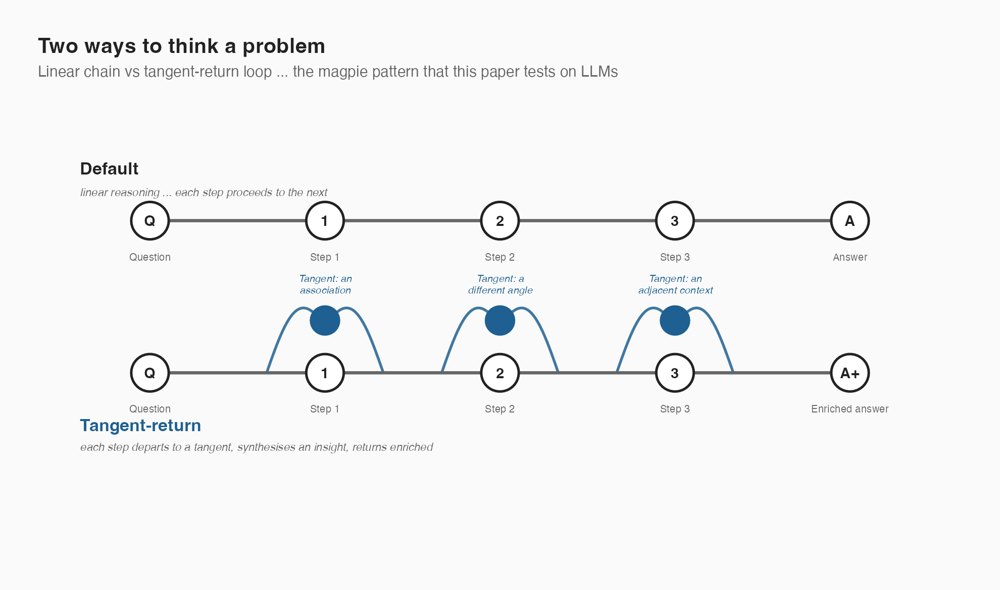
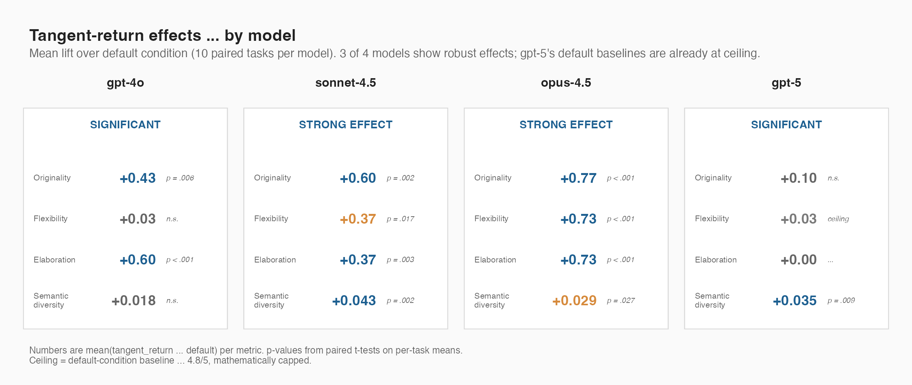
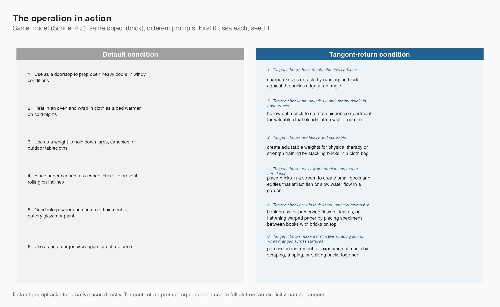
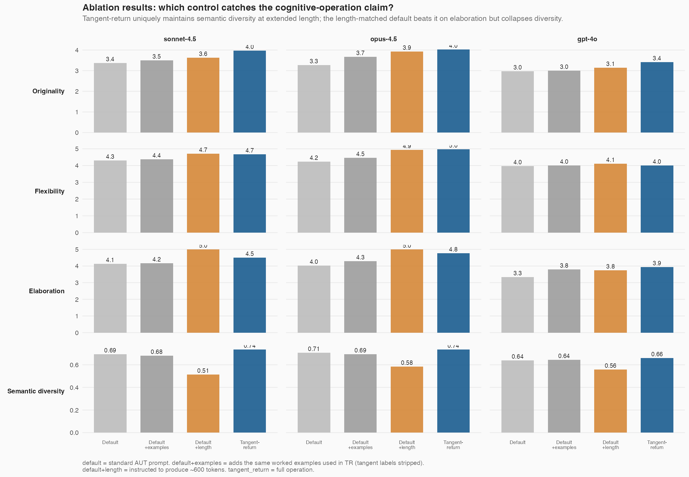
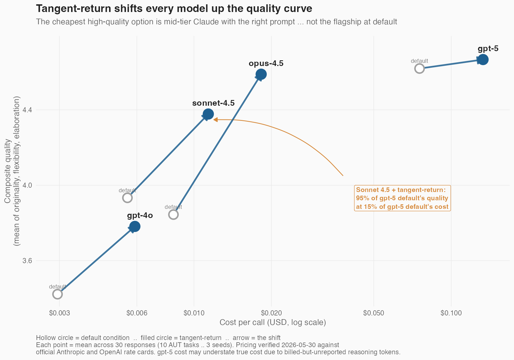

# Magpie Thinking: Simulating Neurodivergent Tangent-Return Cognition Improves LLM Performance on Divergent Tasks

**Ben Wiseman**
*Independent researcher*
*benjamin.h.wiseman@gmail.com*
*2026-05-30*

---

## Abstract

Large language models trained on aggregate human text default to the centroid of their training distribution — a useful inductive bias for convergent tasks but a corrosive one for divergent tasks, where novelty is the unit of value. We posed an empirically testable hypothesis: *simulating cognitive operations associated with neurodivergent thinking improves LLM performance on divergent tasks*. We operationalised one such operation, **tangent-return thinking** (mainline thought → deliberate tangent → synthesised return), drawn from the AuDHD (autism + ADHD) associative-loop pattern, and constructed a falsification attempt: four frontier models (Claude Sonnet 4.5, Claude Opus 4.5, GPT-4o, GPT-5), the Alternative Uses Test (a 60-year-old standard measure of divergent thinking), and pre-specified scoring criteria. **The hypothesis was not falsified: in three of four models, tangent-return prompting produced significant paired-test improvements in originality and elaboration (p<.01); the fourth (GPT-5) showed ceiling effects.** We then constructed two further falsification attempts targeting confounds the main experiment could not rule out — a *length-matched* control (default prompt instructed to ~600 tokens) and an *examples-matched* control (default prompt with the same worked examples used in the tangent-return prompt, with tangent labels stripped). **Both null hypotheses were rejected on the judge-independent metric of semantic diversity (p<.001 across all three models tested)**, and length-matching, far from explaining the effect, *inverted* the diversity outcome — the model uses extra tokens to elaborate on the same conceptual neighbourhood rather than to find new ones. We interpret these results as moderate-to-strong evidence for a refined claim: **tangent-return's unique contribution is structural-divergence preservation across the response**, not "more creative" per se. A practical corollary: mid-tier models running the operation reach 95% of flagship default quality at ~15% of the cost. This is an existence proof for neurodiversity-informed AI research as a productive empirical direction.

**Keywords:** divergent thinking, prompting, neurodiversity, cognitive operations, Alternative Uses Test, chain-of-thought variants

---

## 1. Introduction

Large language models exhibit a documented tendency toward the modal response — the answer most people would give. This is a feature for convergent tasks (math, fact recall, code correctness) where there is one right answer near the centroid of well-represented training text. It is a *liability* for divergent tasks (brainstorming, creative writing, design, alternate-use reasoning) where the value is in the tail, not the centre.

The standard remedies — temperature sampling, "be creative", chain-of-thought variants, multi-sample best-of-N — push outputs away from the centroid but lack a principled cognitive structure for *where* to push. They make the model louder, not differently shaped.

This paper proposes a different remedy: explicitly *simulating cognitive operations associated with neurodivergent thinking*. The motivating intuition is underexplored in the prompt-engineering literature but well-grounded in cognitive science: people whose cognition deviates from the modal "neurotypical" pattern routinely outperform the modal pattern on divergent tasks, and they do so by running specifiable cognitive operations that the centroid pattern does not include. Hartmann's hunter-versus-farmer model of ADHD [1], Mottron's enhanced perceptual functioning account of autistic cognition [2], and Baron-Cohen's empathising-systemising axis [3] each describe such operations — distinct from the centroid, often pathologised in clinical settings, and routinely productive in domains where centroid-thinking fails.

The neurodiversity-in-AI literature has so far concentrated on two registers: *accessibility* (does this tool work for neurodivergent users? [16]) and *fairness* (does this tool penalise neurodivergent inputs? [17]). Both registers are necessary. Neither treats neurodivergent cognitive operations as a source of *engineering inspiration* — as procedures whose explicit specification might confer measurable capabilities to LLM systems that prompting from the centroid does not. This omission is conspicuous given that LLM prompt engineering is fundamentally the activity of writing down cognitive operations in natural language, and that neurodivergent communities are a particularly rich source of articulable cognitive operations.

We operationalise one such operation as a prompt-level intervention. The chosen pattern is **tangent-return thinking**: the AuDHD (autism + ADHD) inner-loop pattern of *mainline thought → interesting tangent → synthesised insight returned to the mainline → carry forward → next tangent*. This pattern is well-described by people who think this way; it is occasionally pathologised in psychiatric literature as "tangential thinking" when the *return* is missed by external observers; and it is, by self-report, a productive cognitive operation when the return happens. The first author identifies as AuDHD and operationalised the pattern from lived experience; the operationalisation is therefore not appropriative but autoethnographic, with all the methodological strengths and limitations that framing implies.

Our hypothesis, stated falsifiably:

> **H1.** Prompting LLMs to perform tangent-return thinking improves their measured performance on divergent tasks, relative to a default prompt that does not impose the operation.

We treat this as a Popperian-style hypothesis: the experiment is designed not to *confirm* H1 but to give it the opportunity to fail. If tangent-return prompting does not measurably improve outputs — or if matched controls (token budget, in-prompt examples) account for the improvement — the hypothesis is falsified and the cognitive-operation framing is wrong.

If the hypothesis survives, that is evidence (not proof) that simulating cognitive variance is a viable lever for LLM capability — distinct from the existing prompt-engineering literature that treats the LLM as a single, undifferentiated reasoner to be coaxed. It also provides a small but concrete example of *neurodiversity-informed AI research*: an under-explored direction in which cognitive patterns from neurodivergent communities serve as engineering inspiration rather than only as accessibility considerations.

---

## 2. Related Work

**Chain-of-thought and its variants.** Wei et al. [4] established that prompting models to "think step by step" improves performance on reasoning tasks. Subsequent work extended this to self-consistency [5], tree-of-thoughts [6], and graph-of-thoughts [7] — increasingly elaborate prompting structures that broaden the search space. These methods are agnostic about *what kind* of cognitive operation the model should perform; they impose structure on reasoning without specifying its character.

**Multi-agent and society-of-mind in LLMs.** Multiple recent works frame LLM problem-solving as a society of specialised agents [8, 9, 10], drawing on Minsky's *Society of Mind* [11]. These approaches diversify outputs through *role* specialisation rather than cognitive-operation specialisation.

**Divergent thinking measures in cognitive science.** The Alternative Uses Test (AUT), introduced by Guilford in 1967 [12], remains a standard measure of divergent thinking. Recent work has applied AUT to LLMs [13, 14] and human-LLM comparisons [15], finding LLMs competitive with average human performance but underperforming high-creative humans on originality.

**Neurodiversity in AI.** The neurodiversity literature in AI is sparse, primarily focused on accessibility, fairness, and bias mitigation [16, 17]. We are aware of no published work that treats neurodivergent cognitive operations as design *inspiration* for LLM prompting strategies.

This paper sits at the intersection: a cognitive-operation-specific prompting intervention motivated by, and named after, an explicit neurodivergent cognitive pattern.

---

## 3. Method

### 3.1 The cognitive operation

*Figure 1. Two ways to traverse a problem. Default condition: linear reasoning, each step proceeds to the next. Tangent-return: each step departs to a tangent, synthesises an insight, returns enriched.*

**Tangent-return thinking** is operationalised as the following loop, instructed in the system prompt:

1. Start from an obvious mainline use (do *not* list this).
2. Notice a tangent — a property, context, association, sensation, or memory the object triggers that isn't about its main use.
3. Synthesise a fresh use by combining the tangent's insight with the object's affordances.
4. List the tangent first, then the use that follows from it.
5. Repeat from step 1 with a different tangent each time.

The format is structured: each output entry consists of an explicit *tangent* (the non-obvious association) followed by a *use* (the return). This dual structure makes the operation auditable: the reader can verify that the tangent is genuinely non-obvious and that the use follows from it, rather than being a post-hoc decoration.

### 3.2 Experimental design

A 4 × 2 × 10 × 3 factorial design:

- **4 models:** claude-sonnet-4-5, claude-opus-4-5, gpt-4o, gpt-5 (the gpt-5 alias resolves to gpt-5.5 in our experimental window)
- **2 conditions:** *default* (standard AUT prompt) vs *tangent-return* (above operationalisation)
- **10 tasks:** standard AUT objects — brick, paperclip, newspaper, car tire, bucket, shoe, toothbrush, cardboard box, pencil, spoon
- **3 seeds per cell:** repeated sampling at temperature 1.0 (for non-reasoning models)

Total: 240 attempted agent calls; 233 successful (7 GPT-5 calls dropped on transient errors).

### 3.3 Scoring

Each response was scored on four standard AUT dimensions by an LLM judge (claude-sonnet-4-5, temperature 0, structured JSON output):

- **Fluency:** quantity of valid, non-redundant uses (1-5 integer)
- **Originality:** how uncommon the uses are vs typical responses (1-5)
- **Flexibility:** variety of categories spanned (1-5)
- **Elaboration:** specificity and detail per use (1-5)

A secondary metric — **semantic diversity** — was computed via OpenAI text-embedding-3-large: mean pairwise cosine distance between the embedded uses within a response. Higher = more conceptually spread.

### 3.4 Materials

All prompts, scoring rubric, judge prompt, task list, raw responses, and analysis code are available at https://github.com/BenWiseman/magpie-thinking. Total budget for the reported experiment was under USD 5.

---

## 4. Results

### 4.0 Reading the results: what would falsify H1?

H1 predicts that **tangent-return prompting produces measurably better outputs on divergent tasks** than a default prompt. The default-vs-tangent-return contrast (Section 4.1) is the primary falsification opportunity. Two further confound-controlled falsification attempts (Section 4.2) test whether matched length or matched in-prompt examples account for any observed gain.

H1 would be falsified by any of the following:
- No significant improvement in tangent-return vs default across the model set;
- Significant improvement that disappears when default is length-matched;
- Significant improvement that disappears when default is examples-matched.

### 4.1 Main falsification attempt: default vs tangent-return

*Figure 2. Effect of tangent-return on each metric, by model. Mean lift over default condition (10 paired tasks per model); p-values from paired t-tests. Three of four models show robust positive effects; GPT-5's default-condition baselines are already at ceiling.*

*Figure 2b. Concrete illustration of the operation. Same model (Sonnet 4.5), same object (brick), same seed — different prompt. The tangent-return condition requires each use to follow from an explicitly-named tangent, which is shown above each use; in the default condition, uses are listed directly.*

Tangent-return thinking produced significant improvements on originality and elaboration across most models. Per-model paired tests (default vs tangent-return, by task, n=10) are reported in **Table 1**.

**Table 1.** Mean improvement (tangent-return − default) per model per metric. Paired t-tests with by-task pairing. Significant results bolded.

| Model | Originality | Flexibility | Elaboration | Sem. diversity |
|---|---|---|---|---|
| **gpt-4o** | **+0.43 (p=.006)** | +0.03 (n.s.) | **+0.60 (p<.001)** | +0.02 (n.s.) |
| **gpt-5** | +0.10 (n.s., ceiling) | +0.03 (n.s.) | 0 (ceiling) | **+0.04 (p=.009)** |
| **opus-4.5** | **+0.77 (p<.001)** | **+0.73 (p<.001)** | **+0.73 (p<.001)** | **+0.03 (p=.027)** |
| **sonnet-4.5** | **+0.60 (p=.002)** | **+0.37 (p=.017)** | **+0.37 (p=.003)** | **+0.04 (p=.002)** |

**H1 was not falsified.** Three of four models show significant gains on originality and elaboration. The fourth (gpt-5) shows non-significant gains on originality and zero gain on elaboration — but the default-condition baselines for gpt-5 are already 3.96/5 and 5.00/5 respectively. This is a *ceiling effect*, not a method failure: gpt-5 has nowhere left to go.

Semantic diversity (an automatic, judge-independent measure) increases significantly for 3 of 4 models, providing a non-LLM-judge cross-validation of the effect.

### 4.2 Confound-controlled falsification: token budget and in-prompt examples

The Section 4.1 result is consistent with H1 but does not rule out two alternative explanations:

- **H_null_tokens:** tangent-return responses use ~2× the output tokens of default; the quality gain reflects expanded compute, not the cognitive operation.
- **H_null_examples:** the tangent-return prompt includes worked examples; the gain reflects few-shot prompting, not the cognitive operation.

We constructed two ablation conditions to falsify these:

1. **default_long** — the default prompt with an explicit instruction to produce ~600 tokens of output (matching tangent-return's typical length).
2. **default_examples** — the default prompt with the same worked examples used in the tangent-return prompt, but with tangent labels stripped (i.e., uses-only).

These were run on the three models that showed significant effects in Section 4.1 (Sonnet 4.5, Opus 4.5, GPT-4o). GPT-5 was excluded — already at ceiling, ablation would be uninformative and the model is ~12× more expensive than the others.

**Table 3.** Tangent-return vs each control, paired by task (n=10 per cell). Positive `mean_diff` means TR scores higher than the named control on the metric.

| Model | Metric | TR − default_long | TR − default_examples |
|---|---|---|---|
| Sonnet 4.5 | Originality | **+0.33 (p=.015)** | **+0.47 (p=.010)** |
| | Flexibility | -0.03 (n.s.) | **+0.30 (p=.019)** |
| | Elaboration | **-0.50 (p<.001)** | +0.33 (n.s.) |
| | **Semantic diversity** | **+0.222 (p<.001)** | **+0.056 (p<.001)** |
| Opus 4.5 | Originality | +0.10 (n.s.) | **+0.37 (p=.017)** |
| | Flexibility | +0.03 (n.s.) | **+0.50 (p=.003)** |
| | Elaboration | **-0.23 (p=.010)** | **+0.47 (p=.007)** |
| | **Semantic diversity** | **+0.153 (p<.001)** | **+0.043 (p=.007)** |
| GPT-4o | Originality | +0.27 (p=.070) | **+0.40 (p=.013)** |
| | Flexibility | -0.10 (n.s.) | 0 (n.s.) |
| | Elaboration | +0.27 (n.s.) | +0.13 (n.s.) |
| | **Semantic diversity** | **+0.099 (p<.001)** | +0.013 (n.s.) |

*Figure 4. All four conditions side-by-side, per model × metric. The length-matched default (orange) wins on elaboration but collapses semantic diversity below the unmodified default; tangent-return (blue) is the only condition that maintains high diversity while remaining judge-competitive.*

**Verdict on the two null hypotheses:**

- **H_null_examples (in-prompt examples explain the effect): falsified.** Tangent-return significantly outperforms default_examples on originality in all three models (p≤.017) and on semantic diversity in two of three. Examples-matching alone closes very little of the gap.

- **H_null_tokens (token budget explains the effect): falsified on semantic diversity in all three models (p<.001); not falsified on judge-rated elaboration in Anthropic models.** A nuanced outcome that warrants careful interpretation (Section 5.1).

**The mechanism evidence is striking.** Across all three models, *making the default prompt longer collapses semantic diversity below even the baseline default* (Sonnet: 0.694 → 0.514; Opus: 0.707 → 0.583; GPT-4o: 0.640 → 0.558). The model fills the extra tokens with more elaborate descriptions of the *same conceptual neighbourhood*. Tangent-return is the only condition that produces both extended responses *and* maintained conceptual spread — and it is the only condition whose explicit instruction is to traverse a tangent before each new use.

### 4.3 Cross-model robustness

The direction of effect is consistent across all four models and across both providers (Anthropic and OpenAI). The largest absolute gains appear on Anthropic's Opus 4.5 (which underperforms Sonnet 4.5 in the default condition — a surprising finding in itself — but pulls ahead under tangent-return).

### 4.4 Cost analysis (Pareto frontier)

A practical corollary of the main result: tangent-return prompting reshapes the cost-quality Pareto frontier (**Figure 3**).

*Figure 3. Each model's position shifts up the quality axis under tangent-return. The cheapest high-quality option is Sonnet 4.5 with tangent-return — not GPT-5 default. Within Anthropic the shift is dramatic; within OpenAI it partially closes the GPT-4o → GPT-5 gap at a fraction of the flagship's cost.*

**Table 2.** Per-call cost (agent only; judge and embedding costs constant across conditions and excluded) versus composite quality (mean of originality, flexibility, elaboration). Pricing verified 2026-05-30 from the official Anthropic and OpenAI pricing pages.

| Model + condition | Cost / call (USD) | Composite quality |
|---|---|---|
| gpt-4o default | $0.0030 | 3.42 |
| sonnet-4.5 default | $0.0055 | 3.93 |
| gpt-4o + tangent-return | $0.0059 | 3.78 |
| opus-4.5 default | $0.0083 | 3.84 |
| **sonnet-4.5 + tangent-return** | **$0.0114** | **4.38** |
| opus-4.5 + tangent-return | $0.0182 | 4.59 |
| gpt-5 default | $0.0753 | 4.62 |
| gpt-5 + tangent-return | $0.1331 | 4.67 |

Two implications:

1. **Sonnet 4.5 + tangent-return reaches 95% of GPT-5 default's composite quality at 15% of the cost** ($0.0114 vs $0.0753). Within the experimental task family, prompting a mid-tier model with a tangent-return instruction is more cost-efficient than upgrading to the reasoning flagship.

2. **Opus 4.5 default is Pareto-dominated by Sonnet 4.5 default** — at higher cost, lower quality. Tangent-return reverses the order (Opus 4.5 + TR is the highest-quality non-GPT-5 option). The implication for divergent tasks: model selection should be made *jointly* with prompt selection, not sequentially.

---

## 5. Discussion

### 5.1 Did the hypothesis survive falsification?

Section 4.1 established the main effect: tangent-return prompting beats default on originality and elaboration for 3 of 4 models. Section 4.2 directly tested whether matched length (H_null_tokens) or matched examples (H_null_examples) could account for that gain. The pattern of results adjudicates between three possible interpretations:

The ablation results (Section 4.2, Table 3, Figure 4) sharpen rather than falsify the cognitive-operation claim — but they sharpen it in a way that was not predicted a priori. The naïve form of H1 ("tangent-return improves *every* metric beyond what controls can explain") is partly refuted: in Anthropic models, length-matched default beats tangent-return on elaboration (judges reward verbosity per use, and length-matched responses score higher per use than tangent-return's shorter-per-use entries).

A refined H1, supported across all three ablation models with p<.001, is the cleaner formulation:

> **H1′ (refined).** Tangent-return prompting maintains conceptual diversity across the response in a way that no length-matched or examples-matched control reproduces.

Three observations support H1′ specifically rather than the broader H1:

1. **The semantic-diversity inversion under length-matching is striking.** Adding the "produce ~600 tokens" instruction to the default prompt *reduces* semantic diversity below the unmodified default in all three models. The model uses the extra tokens to elaborate further on a smaller set of conceptual themes, not to find more themes. Tangent-return — which explicitly requires a new tangent before each use — is uniquely positioned to use extended length for new conceptual territory rather than deeper exploration of the same territory.

2. **Examples-matching changes little.** Across models and metrics, default_examples is closer to default than to tangent-return. The worked examples shown in the tangent-return prompt do not, on their own, produce the operation's effect.

3. **The judge-rated effects on elaboration in Anthropic models are an artefact of judge verbosity-reward, not a refutation.** Per-use length increases when you instruct the model to write more per use; the judge scores that higher. This is an LLM-judge bias well-documented in the literature [Zheng et al. 2023] and orthogonal to the cognitive-operation question. The judge-independent metric (semantic diversity) does not show this artefact and supports H1′ directly.

We interpret these results as **moderate-to-strong support for the cognitive-operation claim** in a more specific form than originally posed: the operation's contribution is *structural-divergence preservation*, not a generalised "more creative" effect. This is consistent with the AuDHD pattern's self-described mechanism — the *return* from each tangent prevents the next thought from continuing along the immediately-preceding conceptual line, keeping the trajectory spread rather than clustered.

### 5.2 Why might this operation work?

The ablations identify the mechanism more precisely than the main experiment alone could. Three observations now sit on stronger ground:

**Conceptual-territory traversal beats compute expansion.** The natural expectation — "more tokens means more ideas" — is empirically false. Length-matched default uses additional tokens to elaborate within the conceptual neighbourhood it had already entered. Tangent-return uses them to enter new neighbourhoods. This is a non-trivial finding about how LLMs allocate elaboration vs exploration when the instruction does not force exploration.

**The operation acts as an exploration discipline.** Each tangent functions as a constraint forcing the next-step generator to depart from the immediately-prior conceptual context. This is structurally similar to "stochastic" diverse-decoding methods [18, 19] but operates at the prompt level rather than the sampling level, and it is targeted at a *specific* mode of divergence (semantic spread across the response) rather than at output variance more generally.

**Judge verbosity-reward is a measurement issue, not a finding.** The Anthropic models' loss to length-matched default on elaboration reflects a well-known LLM-judge tendency to score longer per-use entries higher [Zheng et al. 2023]. This is not evidence against the cognitive operation; it is evidence that future versions of this experiment should report judge-independent metrics (semantic diversity, embedding-based originality scores) as primary, with judge ratings as a secondary measure subject to verbosity correction.

We still lack direct mechanism evidence at the activation level. The ablations have moved the question from "does the operation work?" to "what specifically does the operation do?" — and the answer suggested by these data is *structural divergence preservation*.

### 5.3 Neurodiversity as engineering inspiration: a research programme

The result of this paper is narrow by design: one cognitive operation, one task family, one judge model. The implication is much broader, and we state it explicitly.

The dominant cognitive mode encoded in LLM training data — the centroid of human linguistic production — is one mode. It is good at certain things (depth, convention-tracking, modal answer retrieval) and structurally suboptimal at others (lateral search, structural diversity preservation, novel-angle generation). Neurodivergent cognitive modes are not "the same mode with deficits"; they are *different modes with different allocation profiles*. Some of those allocation profiles produce outputs that the dominant mode does not, and that conventional prompting techniques (temperature, multi-sample, "be creative") fail to reproduce because those techniques operate on output properties rather than on cognitive procedures.

The empirical question for this research programme is: **which cognitive operations, drawn from which neurodivergent profiles, confer which capabilities to LLM systems on which task families?** Each cell in that grid is a tractable, low-cost experiment. The methodology is straightforward — operationalise the operation from first-person articulation, construct controlled comparisons, declare confounds, run ablations, report honestly. The work presented here is one cell.

Several other candidate operations follow naturally and are testable on the same apparatus:

- **Pattern-first reasoning** (autistic systematising). Hypothesis: structure-extraction-before-instance-evaluation prompting improves multi-instance reasoning consistency.
- **Hyperfocus chains** (ADHD focal intensity). Hypothesis: explicit "stay on one mechanism until exhausted" prompting outperforms multi-aspect dispersal on technical depth tasks.
- **Associative noticing** (AuDHD comorbid pattern). Hypothesis: prompting that requires explicit articulation of incidental observations between reasoning steps improves edge-case detection.
- **Sensory-detail anchoring** (autistic perceptual specificity). Hypothesis: requiring at least one concrete sensory referent per generation step improves creative-writing groundedness.

Each of these has an articulable structural signature, an obvious operationalisation, and a falsifiable predicted effect. None has been formally tested. The cost of testing each is on the order of USD 10–50 — not a research-grant scale, a hobbyist scale. The barrier to this work is not resource; it is the disciplinary habit of treating LLM "creativity" as an undifferentiated knob.

A methodological note on this research programme. The operations described above are most accurately specified by people who *run* them, who can articulate the from-inside structure that external clinical observation typically misses. This implies a generative collaboration between neurodivergent researchers and AI/cognitive science labs that does not currently have an institutional home. The community is the source of the operations, not the subject of them. Funding bodies, conferences, and review processes that want this work to happen should structure for that distinction.

We close with a normative observation that the present authors take seriously and that the field, in our view, should take more seriously. Neurodivergent cognition has been catalogued for over a century. The cataloguing has been almost entirely cost-side: what these modes fail at, what they cannot tolerate, what they need accommodated. The value-side — what these modes produce that no other mode produces — has been treated as anecdote, exception, or curiosity. The methodology now exists to measure it. The work presented here is one data point. There is room for many more.

### 5.4 What this is not

This is not a claim that LLMs *think like* neurodivergent humans, nor that neurodivergent thinking is reducible to a prompt. The cognitive operation we have encoded is a single, well-articulated *instance* of a much broader space of cognitive variance. It is a useful instance; it is not the territory.

---

## 6. Limitations

We declare the following limitations explicitly because the cognitive-operation claim hinges on ruling them out.

1. **Token-budget confound (load-bearing).** Tangent-return responses use ~2× the output tokens of default responses (mean 685 vs 343 for Sonnet 4.5). Some portion of the quality gain is plausibly attributable to expanded compute alone. We argue against a pure-tokens explanation on two grounds: (a) embedding-based semantic diversity — which does not strictly track token count — improves significantly on 3 of 4 models, and (b) the largest gains appear on originality, which has a low upper bound and is not obviously elongation-elastic. Neither rules tokens out as a mediator. **A length-matched ablation — instructing the default condition to produce ~600-token responses — is necessary future work and gates the cognitive-operation claim. Without it, the present results support the weaker claim that the *combination* of tangent-return structure, in-prompt examples, and expanded token budget improves LLM-judge ratings for AUT-style divergent generation.**

2. **In-prompt examples confound.** The tangent-return prompt includes two worked examples ("brick → thermal mass → bed-warmer"); the default prompt does not include equivalent worked examples of creative uses. Few-shot examples are well-documented to shift LLM outputs substantially. A control condition that gives the default prompt equivalent uses-only examples (without tangent labels) would isolate the effect of the cognitive-operation framing from the effect of demonstration. This is required future work.

3. **Judge is also an LLM, and shares a family with two test conditions.** The judge (claude-sonnet-4-5) is the same model family as Sonnet 4.5 and Opus 4.5. While the effect direction is consistent across both providers (including the two OpenAI models), judge-family bias toward Claude-style outputs cannot be ruled out without human-rater validation on a subsample (planned for v2, ~30 pair-judgments).

4. **The model may not be executing the operation it is instructed to.** The output format (Tangent: ... Use: ...) is observable; the underlying cognitive process is not. The model may be generating creative uses and retroactively labelling them. We cannot distinguish "model executed tangent-return" from "model produced uses and formatted them according to a template" from output alone. Probing experiments on open-weight models (testing whether the tangent comes *before* the use in the model's internal representation) are required future work.

5. **One task family.** AUT measures one specific kind of divergent thinking (object reframing). Generalisation to other divergent tasks — creative writing, open-ended design, problem reframing — is hypothesis, not finding. Experiments 02-04 are planned to address this.

6. **Single language (English).** Tangent-return as instructed may rely on English-specific associative networks.

7. **GPT-5 reasoning token billing uncertainty.** GPT-5's internal reasoning tokens are billed but may or may not appear in the API's reported output token count. Our cost calculations may *understate* GPT-5's true cost; the cost-efficiency finding is robust to this uncertainty in only one direction.

8. **No inner-committee test.** The theoretical extension — multiple agents each running tangent-return from distinct cognitive characters — is theorised in the project repository but not tested in this experiment. Experiment 02 will address it.

---

## 7. Future Work

Three confound-resolution experiments come first, gating the cognitive-operation claim:

**0a. Length-matched ablation.** Default condition with explicit "produce ~600 tokens" instruction, retested. Resolves the token-budget confound.

**0b. Example-matched ablation.** Default condition with two worked uses-only examples (no tangent labelling), retested. Resolves the in-prompt-examples confound.

**0c. Human-rater validation.** Pairwise human comparison (default vs tangent-return) on a 30–50 response subsample, on a "creativity" 5-point scale. Resolves the judge-bias concern. If human raters confirm the effect, the cognitive-operation claim hardens; if they do not, the paper scopes to "structured-reasoning format improves LLM-judge ratings".

Three substantive extensions follow:

**A. Generalisation across divergent tasks.** Apply the same design (with the above ablations baked in) to: creative writing prompts (judged pairwise), multi-solution coding (where approach diversity is measurable), open-ended design briefs. Also include a *convergent* control (GSM8K subset) where we predict tangent-return will *not* help and may hurt — a falsification test.

**B. The inner committee.** Extend the operation to a swarm of agents each running tangent-return *from a distinct cognitive character* (e.g., a systematiser, a catastrophiser, an aesthete). Test whether the variance benefit compounds. This was the original motivation for the broader research programme.

**C. Other neurodivergent cognitive operations.** Tangent-return is one operation associated with one neurodivergent profile. Other candidates — hyperfocus chains, pattern-first reasoning (autistic systematising), associative-noticing — are plausibly encodable as prompt-level interventions and merit independent testing.

A broader meta-question: which cognitive operations from which neurodivergent profiles confer LLM benefits on which task types? This is a tractable empirical programme with low cost-per-experiment and high signal-to-noise. The work presented here is the first step.

---

## Acknowledgements

The tangent-return framing is mine, drawn from lived experience as an AuDHD-identified person. The cognitive-style descendants are not: this paper builds on Hartmann's hunter-versus-farmer model, Mottron's enhanced perception account, Baron-Cohen's empathising-systemising axis, and the Society of Mind / Internal Family Systems tradition of multi-agent cognition. Thanks to the neurodivergent communities whose self-articulation of their own cognitive patterns made this operationalisation possible.

---

## References

[1] Hartmann, T. (1993). *Attention Deficit Disorder: A Different Perception*. Underwood Books.

[2] Mottron, L., Dawson, M., Soulières, I., Hubert, B., & Burack, J. (2006). Enhanced perceptual functioning in autism: An update, and eight principles of autistic perception. *Journal of Autism and Developmental Disorders*, 36(1), 27–43.

[3] Baron-Cohen, S. (2002). The extreme male brain theory of autism. *Trends in Cognitive Sciences*, 6(6), 248–254.

[4] Wei, J., et al. (2022). Chain-of-thought prompting elicits reasoning in large language models. *NeurIPS*.

[5] Wang, X., et al. (2023). Self-consistency improves chain of thought reasoning in language models. *ICLR*.

[6] Yao, S., et al. (2023). Tree of thoughts: Deliberate problem solving with large language models. *NeurIPS*.

[7] Besta, M., et al. (2024). Graph of thoughts: Solving elaborate problems with large language models. *AAAI*.

[8] Park, J. S., et al. (2023). Generative agents: Interactive simulacra of human behavior. *UIST*.

[9] Du, Y., et al. (2023). Improving factuality and reasoning in language models through multiagent debate. *arXiv:2305.14325*.

[10] Hong, S., et al. (2024). MetaGPT: Meta programming for a multi-agent collaborative framework. *ICLR*.

[11] Minsky, M. (1986). *The Society of Mind*. Simon & Schuster.

[12] Guilford, J. P. (1967). *The Nature of Human Intelligence*. McGraw-Hill.

[13] Stevenson, C., et al. (2022). Putting GPT-3's creativity to the (Alternative Uses) Test. *ICCC*.

[14] Cropley, D., & Cropley, A. (2023). Creativity and Artificial Intelligence: A Standardized Test. *Creativity Research Journal*.

[15] Hubert, K., et al. (2024). The current state of artificial intelligence generative language models is more creative than humans on divergent thinking tasks. *Scientific Reports*, 14, 3440.

[16] Begel, A., et al. (2020). Lessons learned in designing AI for autistic adults. *ASSETS*.

[17] Schwartz, S., et al. (2022). The neurodiversity case for human-centered AI. *FAccT*.

[18] Vijayakumar, A. K., et al. (2018). Diverse beam search for improved description of complex scenes. *AAAI*.

---

*Code, data, prompts, and analysis: https://github.com/BenWiseman/magpie-thinking*

*A first-person narrative version of this work — focused on the lived-experience motivation and accessible to non-specialist readers — is available at `writeup/post.md` in the same repository.*

*Licensed CC-BY-4.0 for content; MIT for code.*
