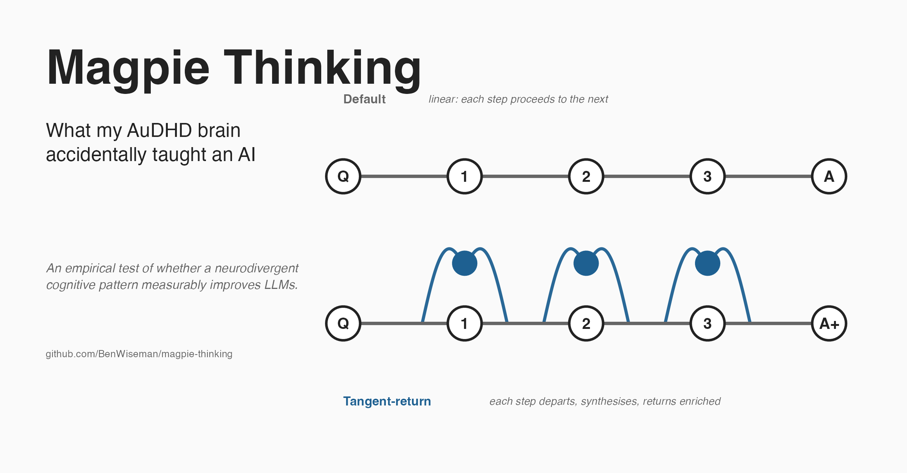

# What my AuDHD brain accidentally taught an AI

*A weekend experiment on whether the way some of us think is worth measuring.*

---

A few years into my last job, my managers ran workshops to figure out how I came up with ideas.

I wasn't doing anything special. At least it didn't feel that way to me. We'd be working through a problem, the room would offer the standard suggestions, and sometimes (not always) I'd say a sentence that shifted what we were looking at. Usually not the final answer. Just an angle nobody had landed on. Written down later it would look obvious.

The honest version of my answer when they asked how I did it was that I wasn't really trying. I was thinking about something else and the connection happened.

I'm not a great teacher of this. The thing I do is involuntary and I can't really turn it off. That was around the time I started understanding that my AuDHD brain (autism plus ADHD, two profiles that show up together a lot) was doing something specific. From outside it was visible as "where do those ideas come from?". From inside it was just how thinking works.

Years later I had a thought. What if I could prompt an LLM to do the same thing my brain does, and see if it produced better outputs?

A weekend of tinkering and five bucks of API calls later, I had an answer.

Short version: across three of the four frontier models I tested, prompting the model to think in the AuDHD pattern produced statistically significant improvements on the standard psychometric measure of divergent thinking. The fourth model (the most expensive reasoning one) was already at ceiling, so there was nowhere to go. Repo, code, data, prompt: [github.com/BenWiseman/magpie-thinking](https://github.com/BenWiseman/magpie-thinking).

The longer version is more interesting. Stay with me.

---

## The pattern, plainly

Here's what happens in my head when I'm working on a problem.

There's a mainline thought, which is the problem. I'm holding it. Then almost immediately the topic triggers something else. Not a related thought, an associated one. A property of the object. A memory. The way light fell in a particular room. Something I read about ant colonies in 2014. The tangent is loud and it demands a few seconds.

I follow it briefly. And then, and this is the part that matters, I bring whatever it had back to the mainline. The mainline is now slightly different. I'm working on the same problem but with a new ingredient. Then another tangent. Then another.

Mainline. Tangent. Synthesise. Return. Loop.

In older clinical literature this gets labelled tangential thinking and treated as a deficit. The observer sees the tangent and concludes the train of thought has come off the rails. That's accurate for what they're observing. They're not observing the return, because the return happens inside someone's head. From outside it looks like luck. Sometimes the tangent-thinker says something useful and they can't quite explain how. People run workshops.

I think of it as graph traversal rather than linear reasoning. A chain of thought is a chain: A leads to B leads to C, single track. What my brain does looks more like a graph. There's a trunk, but every node spawns branches that come back and update the trunk before the next step. A tree that keeps folding back into itself.

Most AuDHD people I know describe their version of this in their own metaphors. I'm calling mine tangent-return thinking. The bird that collects shiny things from everywhere and brings them back to the nest is a magpie, which is what I called the project.

---

## The cost

I'm not writing the "neurodiversity superpower" version of this post. Anyone who tells you their wiring is unambiguously a gift is selling you something. The pattern has real costs.

I'm tired most evenings. Holding mainlines while following tangents is expensive on whatever the cognitive load equivalent of calories is. Conversations with people who think in straight lines are a tax. They're following one thread and I'm following six, and sometimes what comes out of my mouth lands as a non-sequitur. Sometimes it lands as the thing they actually needed to hear. It's a guess each time and I get it wrong often enough.

I sleep badly. I get overstimulated. Crowded rooms are expensive. There are real reasons that ADHD and autism are clinical labels. They describe patterns that, in some environments, are genuinely costly to run.

But the cost has been the only thing the literature measured for about a century. The same machinery that costs you in the wrong environment produces things in the right one. The workshops were happening because the outputs were valued, not because the cost was being graciously accommodated. That's a meaningful distinction, and it's the one I've spent the last few years thinking about.

---

## The hunch

LLMs are trained on aggregate human text. By default they reach for the modal answer, the one most people would give. That's a useful inductive bias for problems with one right answer. It's a corrosive bias for problems where the value is in the tail.

The standard prompting tricks for creative tasks are louder versions of "be creative". Turn up the temperature. Ask for more ideas. Run best-of-N. All of these push the model away from the centre but none of them say where to push, or how. They make the model noisier rather than differently shaped.

The hunch I was sitting with was this. What if you gave the model a *specific cognitive operation*, articulated by someone who actually does it that way? Not "be more creative". The actual structural thing my brain does.

So one Friday night I wrote it down as a falsifiable hypothesis and decided to do an honest test. The Popper version, not the marketing version. Set up an experiment that could embarrass me, then see what happens.

---

## The experiment

Four frontier large language models:

- Claude Sonnet 4.5 (Anthropic, mid-tier)
- Claude Opus 4.5 (Anthropic, flagship)
- GPT-4o (OpenAI, mid-tier)
- GPT-5 (OpenAI, flagship reasoning model)

Two conditions per model. A default prompt asking for creative uses of an everyday object. A tangent-return prompt that operationalises the loop: start from the obvious mainline use, follow a tangent, synthesise it back, list the use that comes out, repeat.

The benchmark was the Alternative Uses Test, a 60-year-old psychology measure of divergent thinking. Pick an object (brick, paperclip, newspaper, shoe), list creative uses. Score on fluency, originality, flexibility, elaboration. Ten objects, three repeated samples per condition, scored by an independent LLM judge using a structured rubric, with embedding-based cross-validation.

The whole thing cost under five dollars and took about 75 minutes. The prompts, code, and data are at the repo.

---

## What landed

The hypothesis didn't get falsified.

Across three of four models, tangent-return significantly improved originality. On Opus 4.5 the gain was +0.77 on a 5-point scale (p<.001). On Sonnet 4.5, +0.60 (p=.002). On GPT-4o, +0.43 (p=.006). GPT-5 was already scoring 3.96 out of 5 in the default condition, so it had nowhere to climb on that metric. Same story for elaboration and flexibility. The judge-independent embedding measure of semantic diversity also improved significantly on three of four models, which matters because LLM judges can be biased and embeddings can't.

Here's what it looks like on a single object (a brick), same model, same seed, just a different prompt:

In plain English, the prompt that asks the model to think the way my brain thinks produced measurably better creative outputs on a classic benchmark across four different frontier models from two different providers.

But I wasn't ready to call this done. "Measurably better" can fail in two boring ways that would falsify the cognitive-operation framing:

1. The model just talked more. Tangent-return responses use about twice the output tokens of default ones. Maybe the quality gain is just thinking out loud for longer.
2. The worked examples in the tangent-return prompt did all the lifting. Few-shot prompting is well-documented. Maybe the structure didn't matter, just the demonstrations.

So I ran two more ablation conditions. One was a length-matched default, instructed to produce around 600 tokens (matching tangent-return's typical length). The other was an examples-matched default, given the same example uses as tangent-return but with the tangent labels stripped.

This is where it got interesting.

Examples alone did almost nothing. Default-plus-examples scored barely above default. The worked examples in the tangent-return prompt are not what's doing the work.

Length alone did something subtle and revealing. When I gave the default prompt the "produce 600 tokens" instruction, the judge scores for elaboration actually went up. Sometimes higher than tangent-return itself. So if you only looked at the judge scores, you'd conclude the model just needed to talk more.

But then I looked at semantic diversity. When the default prompt was forced to produce extra tokens, the responses became *less* conceptually diverse, not more. The model used the extra tokens to elaborate further on the same conceptual themes. Same neighbourhood, deeper exploration. Tangent-return was the only condition that maintained both extended length and high semantic diversity across all three models, with p < 0.001.

Which is exactly what tangent-return is structurally for. Every tangent forces the next thought to depart from the previous neighbourhood. It's a discipline that prevents response collapse. The LLM judge partly obscures this because judges tend to reward verbosity per individual answer (a documented bias), but the embedding measure cuts through and shows the operation's signature plainly.

So the headline I started with was wrong, in a useful way. It's not "tangent-return makes the model better at everything". It's something more specific: tangent-return preserves conceptual spread across a response in a way that nothing else replicates. It's not thinking more, it's thinking in more places.

That's the shape of a real finding. I went in trying to falsify, ran two of the most obvious confound-controlled experiments, and what survived was more specific and more defensible than the claim I started with.

---

## The cost-quality kicker

There's a practical consequence I didn't anticipate.

GPT-5 won the default-condition comparison cleanly. With no creative prompting beyond "list uses", it produced the highest-quality outputs by a meaningful margin. But GPT-5 is expensive. A single AUT response from GPT-5 costs around $0.075. A response from Sonnet 4.5 costs $0.0055. Roughly 14 times cheaper.

Add tangent-return prompting to Sonnet and its composite quality climbs to 4.38 out of 5. GPT-5's default-condition composite is 4.62. That's 95% of the quality at 15% of the cost.

Prompting Claude like an AuDHD brain produces output competitive with the flagship reasoning model at one-seventh the cost. I let that one sit for a few days.

That curve is what matters for anyone actually building things. If you're a small team trying to do creative work at scale, the constraint is usually what you can afford to run, not what the best model can do in absolute terms. Tangent-return shifts that constraint by an order of magnitude on the work where it applies.

---

## What I think this actually says

Let me try to land what I think the result says about the world, because I've been chewing on it for a few days and I want to get it right.

For about a century, tangent-return has been treated as a clinical symptom. The shorthand is that this person isn't focused, can't stay on topic, isn't being productive the way we measure productive. That's accurate for what an external observer can see. The observer sees the tangent. They don't see the return, because the return happens inside someone's head. From outside it looks like luck.

What the data here say, at a level of empirical precision I don't think has been reached before, is that the return is doing measurable work that nothing else does. Not "creativity" in a soft sense. A specific structural thing.

When you give a thinker extra cognitive bandwidth, the default mode uses it to go deeper on whatever it already said. The tangent-return mode uses it to go somewhere new. Same neighbourhood versus different neighbourhood. Depth versus spread.

Neither is better. They're allocated differently.

That sentence is the one I want to land.

The dominant cognitive pattern goes deeper when given more bandwidth. The neurodivergent pattern goes wider. Neither is better. Both are doing real work. They're doing different work, and the difference is structural, not effortful.

Most workplaces and schools have only ever measured the cost. Sleep, friction, executive function load, the social tax of saying the non-obvious thing in a meeting where everyone else is converging on the obvious thing. Those costs are real. They're real for me. I don't want to gaslight anyone about them.

But the value has been treated as anecdote for a hundred years. "Well, that particular person is special." Or as exception, or as the thing the workshops were trying to extract without quite naming. This experiment is one data point on the other side of the ledger. The pattern produces a structural property that conventional cognition, matched on every confound we tested, does not produce. That isn't anecdote. It's a measurement, with p < 0.001 across three frontier LLMs from two providers.

If your work needs spread, not just depth, the dominant cognitive pattern has been quietly costing you something you couldn't see. That covers more domains than most leadership realises. Finding the right framing of a problem. Generating alternative interpretations of data. Design across constraint spaces. Organisational change. Hiring processes for roles that don't have rubrics yet. The list of jobs that need spread is long, and it overlaps a lot with the list of jobs where ND people get flagged for "not fitting the process".

The inclusion conversation needs an upgrade. The dominant framing is "how do we accommodate people who think differently", which positions ND people as a cost to manage. The data here suggest a better question: what modes does our default cognition systematically miss, and which neurodivergent modes catch them? Once you start asking that question, hiring looks different. Team composition looks different. Meeting structure looks different. You're not lowering a bar to let people through. You're noticing that the bar was measuring one cognitive dimension and ignoring four others.

If you're an ND person reading this: the workshop scene I opened with was real. Your version of it probably is too. The people in the room who weren't producing your outputs weren't trying less hard. They were running a different cognitive operation, allocated for depth where yours is allocated for spread. They aren't worse. You aren't better. Both modes have measurable signatures now, and yours has been treated as a defect for as long as anyone has been measuring it from outside. The thing you do has a name and an effect now. That doesn't fix the cost. It does change what you can say out loud about the value.

If you're a manager, a teacher, a founder, an investor, or anyone else who builds the rooms ND people end up in: the question I'd want you to take from this isn't "how do we make these people fit". It's "what does our existing process miss, and which of these people catch it?". The honest answer changes hiring, meeting structure, who gets credit for the thing nobody else thought of, and probably what gets built.

---

## What I'd love to see next

Tangent-return is one operation associated with one neurodivergent profile, tested on one task family. There are more. Pattern-first reasoning. Hyperfocus chains. Sensory-detail anchoring. Parallel-thread tracking. Associative noticing. The autistic "find the rule first" loop. Most of them are articulable, falsifiable, and cost about five bucks of API calls each to test honestly.

The people best placed to do that work are the ones who run those operations themselves. Not as research subjects. As researchers. There's no shortage of articulate ND people who can describe their own cognitive structure with high precision. There's just a shortage of formats that treat those descriptions as data instead of as backstory. This piece is one small attempt at building that format. The repo is open. The prompt is yours to use. If you run another operation worth testing, I'm easy to find.

---

## Try it yourself

The prompt is short. Paste it into ChatGPT, Claude, Gemini, any chat interface. It's at [github.com/BenWiseman/magpie-thinking/blob/main/prompts/tangent-return.md](https://github.com/BenWiseman/magpie-thinking/blob/main/prompts/tangent-return.md) and licensed for any use.

For Claude Code users, the same operation is packaged as a drop-in skill at [github.com/BenWiseman/magpie-thinking/tree/main/skills/tangent-return](https://github.com/BenWiseman/magpie-thinking/tree/main/skills/tangent-return).

The full preprint with stats, methods, references, and the confounds I haven't yet resolved is in the same repository under [writeup/paper.md](paper.md). It's not peer-reviewed. It explains what was done so others can replicate or contest it.

If the prompt works for you on something interesting I'd love to know. If it doesn't, I'd love to know that too. Null results are part of the picture.

---

*The longer I sit with this the more convinced I am that "inefficient" is doing a lot of unexamined work in how we describe minds, human and artificial. Next experiment tests whether a swarm of agents each running tangent-return from a different cognitive vantage outperforms a clone swarm. Repo subscribe button is where you'd expect it.*
